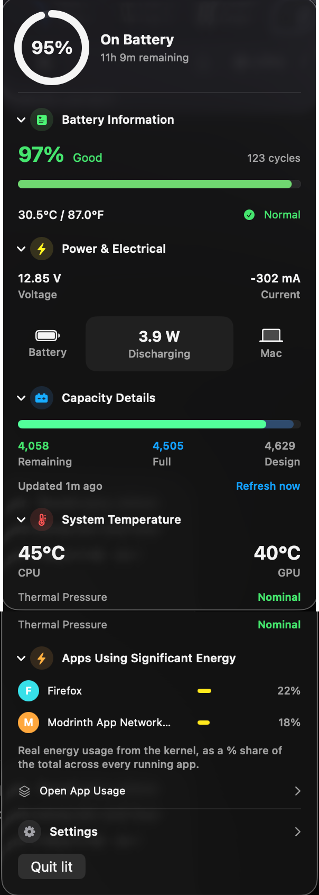

# lit

A free, open-source (MIT) native macOS menu bar app for battery alerts and
health monitoring — a rebuild of [getjuicy.app](https://getjuicy.app) (Juicy)
plus a few ideas of its own.

No account, no subscription, no telemetry. Everything runs locally.



## Features

- **Menu bar glyph** — live percentage, color-coded SF Symbols battery icon,
  charging indicator
- **Battery health** — health %, cycle count, temperature (°C/°F), condition
  badge
- **Power & Electrical** — live voltage, current, wattage, and an animated
  flow diagram between adapter/battery/Mac (while charging, shown as a real
  branch: one adapter source, two simultaneous destinations)
- **Capacity details** — remaining / full / design capacity in mAh
- **System temperature** — CPU/GPU temperature (Apple Silicon) plus thermal
  pressure state
- **Connected devices** — Bluetooth accessory battery (AirPods, Magic
  Mouse/Keyboard/Trackpad), iPhone/iPad battery percentage, and Android
  battery percentage (opt-in from the dashboard; requires USB debugging
  enabled on the phone)
- **Apps using significant energy** — ranked by real per-process energy
  usage, not a CPU-time proxy
- **Custom alert thresholds** — add any percentage, get a real notification
  when you cross it, plus lifecycle alerts (plugged in / unplugged / crossed
  80% while charging)
- **Local web dashboard** — the same stats with more room to breathe, served
  from `127.0.0.1` only, opened from the menu bar's Settings row

Every number is either a real, verified reading or clearly labeled as an
estimate — see [`mac-app/DATA_SOURCES.md`](mac-app/DATA_SOURCES.md) for
exactly which API backs each one, and which are still unverified against
real hardware.

## Install

Download the latest DMG from [Releases](https://github.com/YourAmaryllis/lit/releases),
open it, and drag **lit** into Applications.

Check the release notes for that version: if it's signed & notarized with a
Developer ID certificate, Gatekeeper opens it with no warning; if not,
right-click → Open on first launch.

iPhone/iPad and Android device support ship with the app —
[`libimobiledevice`](https://libimobiledevice.org) and `adb` are bundled, no
`brew install` needed. (On Intel Macs, the bundled `libimobiledevice` tools
are skipped since Homebrew only builds them arm64-only; the app falls back
to a Homebrew install there — `brew install libimobiledevice`.)

Android support is off by default — enable it from the dashboard, under
"Android Device Support" — since it starts a background `adb` server process
the first time it's used. Also requires Developer Options → USB debugging
enabled on the phone.

## Requirements

- macOS 14 (Sonoma) or later
- Apple Silicon or Intel (universal binary)
- CPU/GPU temperature is currently verified only on Apple Silicon; on other
  chips it's simply omitted, never shown incorrectly

## Building from source

```bash
cd mac-app
swift build                    # or: ./Scripts/build-app.sh [debug|release]
```

`swift run` does not work standalone once notifications are involved —
`UNUserNotificationCenter` requires a real `.app` bundle. Use
`./Scripts/build-app.sh` to produce one at `mac-app/.build/Lit.app`.

The bundled `adb`/`libimobiledevice` binaries in `mac-app/Resources/vendor/`
are checked into the repo, so a normal build just picks them up. To
regenerate them from a fresh Homebrew install (e.g. after a version bump),
run `./Scripts/vendor-tools.sh`.

## Project structure

- `mac-app/` — the Swift Package (SwiftUI `MenuBarExtra`) menu bar app
- `site/` — Next.js marketing site
- `scripts/` — release build scripts (`build-app.sh` → universal, versioned
  `dist/Lit.app`; `build-dmg.sh` → `dist/lit-<version>.dmg`;
  `notarize-dmg.sh` → notarizes + staples it)
- `.github/workflows/release.yml` — tag-triggered CI release

## Architecture

Stats appear in two places by design:

- The **menu bar dropdown** (`MenuBarView.swift`, pure SwiftUI) is a rich,
  color-coded, collapsible view for a quick glance.
- The **web dashboard** (`DashboardServer.swift`, a small HTTP/1.1 server on
  `Network.framework`; `Resources/dashboard.html`, a single self-contained
  page) shows the same data with more room, served from `127.0.0.1:7091`
  only — not reachable from the LAN.

Alert thresholds and menu bar icon style are dashboard-only, since they're
editable config rather than stats and don't fit a 300px popover.

## Releasing

Version lives in the `VERSION` file. To cut a release:

```bash
git tag v0.0.1 && git push origin v0.0.1
```

This triggers `.github/workflows/release.yml`, which builds a universal DMG
and publishes a GitHub Release. Can also be run manually via
Actions → Release → Run workflow.

## Signing & notarization

CI signs and notarizes the release DMG automatically once these repo
secrets are set (Settings → Secrets and variables → Actions); with none of
them set, it falls back to an ad-hoc-signed, unsigned build exactly as
before.

1. **Get a Developer ID Application certificate** — Xcode → Settings →
   Accounts → your team → Manage Certificates → **+** → Developer ID
   Application (or via Keychain Access → Certificate Assistant → Request a
   Certificate from a CA, uploaded at
   [developer.apple.com/account/resources/certificates](https://developer.apple.com/account/resources/certificates)).
2. **Export it as a `.p12`** from Keychain Access (right-click the cert →
   Export → set a password), then base64-encode it:
   `base64 -i DeveloperID.p12 | pbcopy`
   - `MACOS_CERTIFICATE_P12` — the base64 output above
   - `MACOS_CERTIFICATE_PASSWORD` — the password you set on export
3. **Create an App Store Connect API key** for notarization —
   [appstoreconnect.apple.com/access/api](https://appstoreconnect.apple.com/access/api),
   role "Developer" is enough:
   - `APPLE_API_KEY_ID` — the key ID shown in the portal
   - `APPLE_API_ISSUER` — the issuer ID shown in the portal
   - `APPLE_API_KEY_P8` — base64 of the downloaded `.p8` file:
     `base64 -i AuthKey_XXXX.p8 | pbcopy`

To test signing/notarization locally instead of through CI:
```bash
CODESIGN_IDENTITY="Developer ID Application: Your Name (TEAMID)" ./scripts/build-dmg.sh
xcrun notarytool store-credentials lit-notary \
  --apple-id you@example.com --team-id TEAMID --password APP_SPECIFIC_PASSWORD
NOTARY_KEYCHAIN_PROFILE=lit-notary ./scripts/notarize-dmg.sh dist/lit-*.dmg
```
(`security find-identity -v -p codesigning` lists the exact identity
string; the app-specific password is generated at
[appleid.apple.com](https://appleid.apple.com), not your main Apple ID
password.)

## Roadmap

- Charge limiting / healthy charge band (needs a privileged helper — writing
  SMC charge-control keys requires elevated permissions)
- iPhone/iPad full battery health (cycle count, temperature — currently only
  percentage and charging state are shown)
- Predictive, calendar-aware alerts
- Custom notification UI (currently uses stock macOS notification banners)

## License

MIT. See [`LICENSE`](LICENSE).

The app bundles prebuilt third-party CLI tools it invokes as subprocesses
(never linked into the binary): `adb` (Apache 2.0, part of Android
Platform Tools) and `libimobiledevice`/`idevice_id`/`ideviceinfo`
(LGPL-2.1), plus their OpenSSL, `libplist`, and `libusbmuxd` dependencies.
See `mac-app/Resources/vendor/` and [`mac-app/DATA_SOURCES.md`](mac-app/DATA_SOURCES.md)
for details.
